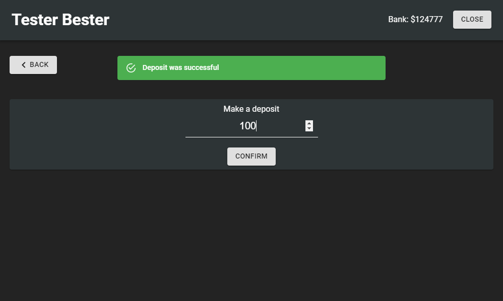
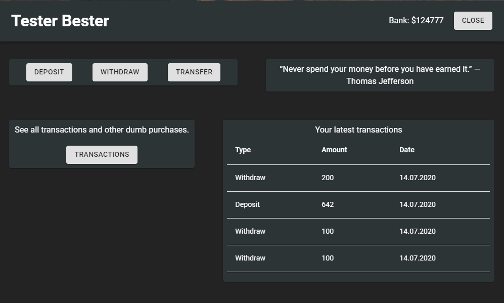
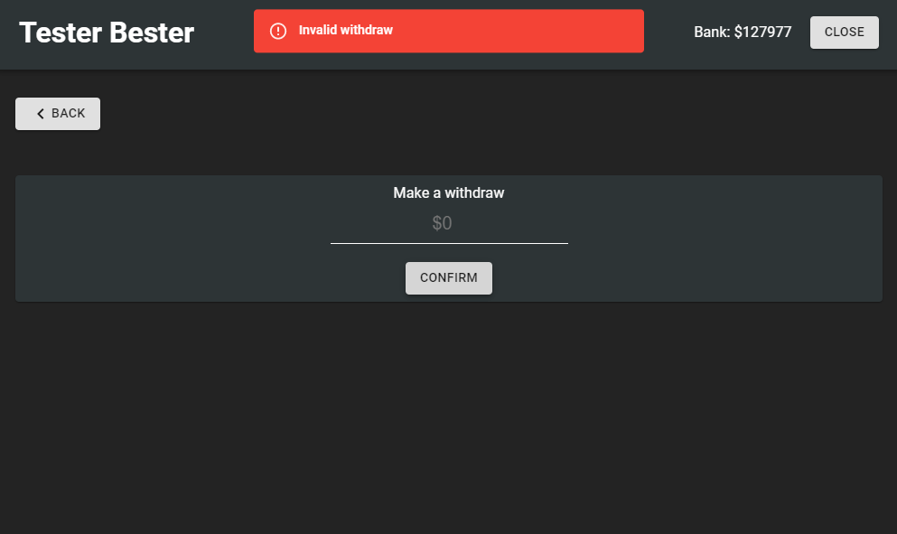
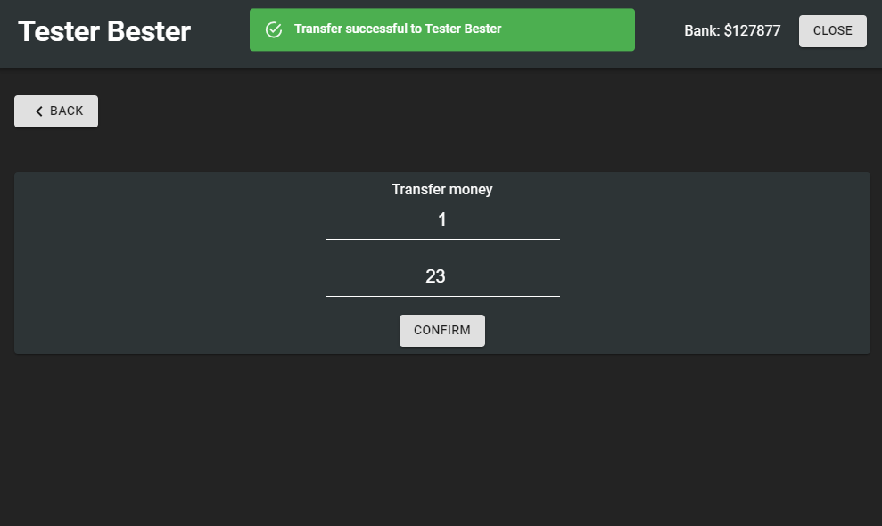
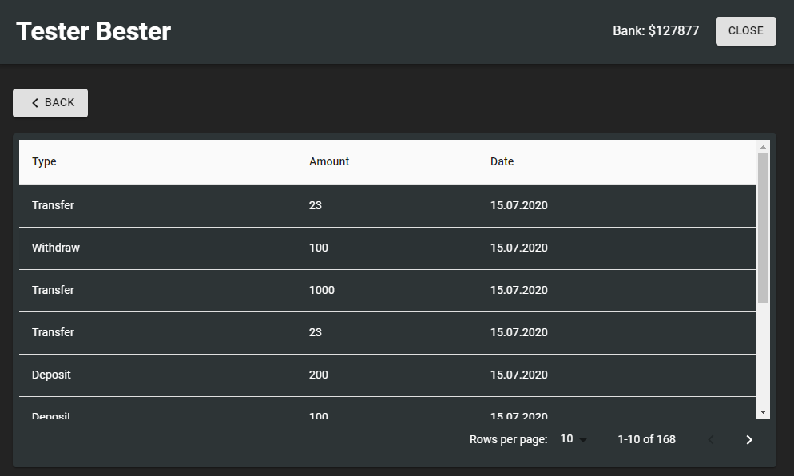

# chip-fivem-banking
A ReactJS bank system built for FiveM, using ESX.

You will be able to deposit, withdraw and transfer. There is also a feat where you can see all you transactions, ever.

# Usage
cd into the web folder and type ``npm install`` in the terminal to install ``node_modules``

Add this query into your database your're using.
```
CREATE TABLE `transactions` (
	`id` INT(11) NOT NULL AUTO_INCREMENT,
	`identifier` VARCHAR(50) NOT NULL COLLATE 'utf8mb4_general_ci',
	`type` VARCHAR(50) NULL DEFAULT NULL COLLATE 'utf8mb4_general_ci',
	`amount` INT(11) NULL DEFAULT NULL,
	`date` VARCHAR(50) NULL DEFAULT NULL COLLATE 'utf8mb4_general_ci',
	PRIMARY KEY (`id`) USING BTREE
)
COLLATE='utf8mb4_general_ci'
ENGINE=InnoDB
AUTO_INCREMENT=182
;
```

# Description
Here are some screenshots


<br>

<br>

<br>

<br>

